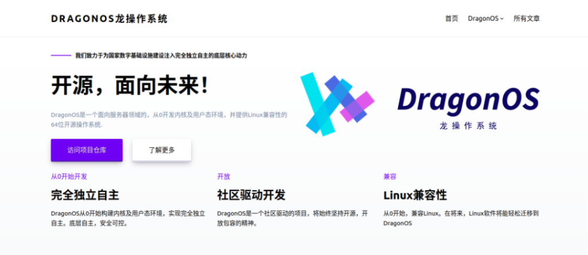
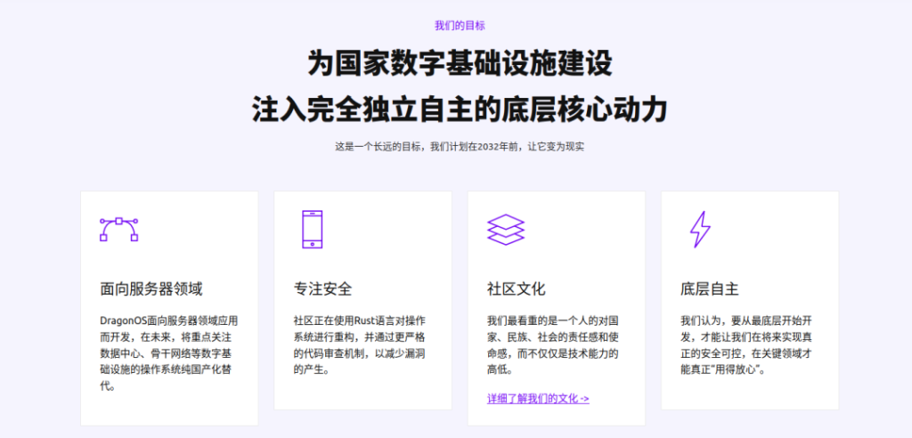

**嘿，各位大佬：**

你们想参与一个完全独立自主、开源的服务器操作系统的开发吗？**DragonOS龙操作系统**正是你们所需要的！今天，我们很高兴地宣布，DragonOS入选了由中科院软件所和openEuler社区主办的

**“2023开源之夏”活动**

我们诚挚地邀请各位开发者加入我们的行列，一起来构建一个完全独立自主的、开源的、高性能及高可靠性的服务器操作系统！

* * *

## **“开源之夏”是什么？**

**开源之夏**是由中科院软件所“开源软件供应链点亮计划”发起并长期支持的一项暑期开源活动，旨在鼓励在校学生积极参与开源软件的开发维护，培养和发掘更多优秀的开发者，促进优秀开源软件社区的蓬勃发展，助力开源软件供应链建设。

作为一个优秀的开源社区，我们为成功入选开源之夏并成为合作单位而感到无比荣幸。

**开源之夏官网：[https://summer-ospp.ac.cn/](https://summer-ospp.ac.cn/)**

* * *

## **迅速了解DragonOS**

**DragonOS**是一个面向服务器领域的64位操作系统，它**从0开发内核及用户态环境**，并提供Linux兼容性。我们使用Rust与C语言进行编写，并正在逐步淘汰原有的C代码，以在将来提供更好的安全性与可靠性。

**DragonOS**开源社区成立于2022年7月，吸引了来自多所高校和企业的21名开发者参与。我们的目标是，构建一个完全独立自主的、开源的、高性能及高可靠性的服务器操作系统，为国家数字基础设施建设注入完全独立自主的底层核心动力。

* * *

## **什么时候发布任务？**

在**4月上旬**，DragonOS社区将发布开源之夏的项目任务列表。按照目前收到的建议，**任务将涉及到虚拟化、现代的日志文件系统、IO缓冲及调度机制以及组调度等服务器操作系统所必须的功能**。这些任务的实现，将使DragonOS在提供Linux兼容性的同时，也具备更好的实用性、更高的安全性和可靠性，成为一个更加强大的操作系统。

伙伴们可以期待一下四月份的任务发布～

如果你对上述的某个方向感兴趣，或者是有更好的想法，**欢迎你通过邮件与我们取得联系**！

* * *

## **社区文化**

在**DragonOS社区**，我们最看重的不仅仅是技术能力的高低，**更看重的是一个人的对国家、民族、社会的责任感和使命感**。在这里，每个成员都能得到充分的尊重，每个人的声音都会被认真对待，每个人都能从工作中收获充足的成就感和自豪感。我们注重协作与沟通，因为，团体的力量大于个人力量的总和。同时，我们鼓励**根源型的创新**，在众人的努力下，为我们国家未来的IT，打下更坚实的基础。

我们相信，每个人都有潜力成为一名优秀的开发者，只要你愿意尝试、努力学习和付出，就一定能在DragonOS社区里实现自己的梦想。

在这里，你将有机会接触到先进的技术，学习到更多的知识，获得更多的成就感和自豪感，同时还能结交更多志同道合的朋友。

我们**期待你的加入**，和你一起开启一个有意义的开源之夏！

* * *
