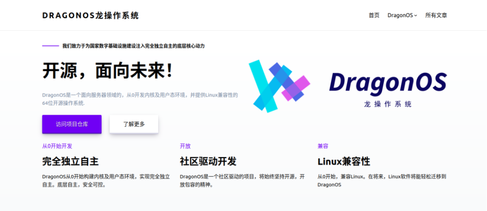
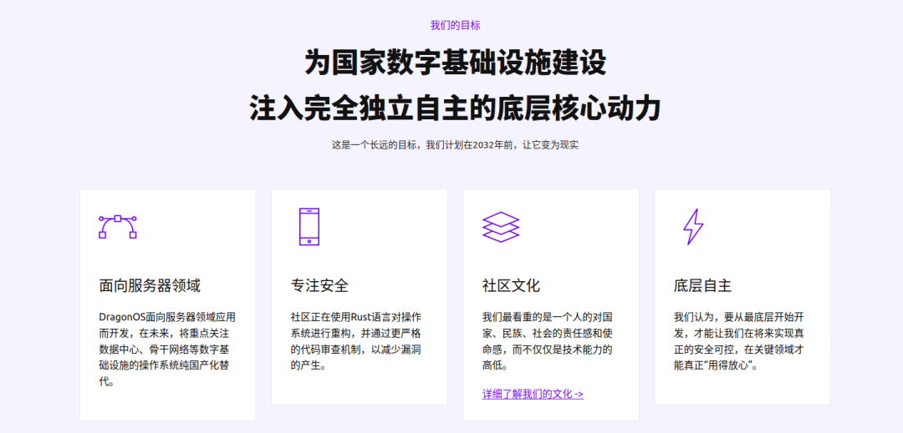

近日，DragonOS正式入选由中科院软件所和openEuler社区主办的“2023开源之夏”活动。我们诚挚地邀请各位开发者加入我们的行列，一起来构建一个完全独立自主的、开源的、高性能及高可靠性的服务器操作系统！

**开源之夏是什么？**

开源之夏是由中科院软件所“开源软件供应链点亮计划”发起并长期支持的一项暑期开源活动，旨在鼓励在校学生积极参与开源软件的开发维护，培养和发掘更多优秀的开发者，促进优秀开源软件社区的蓬勃发展，助力开源软件供应链建设。

       作为一个优秀的开源社区，我们为成功入选开源之夏，并成为合作单位而感到无比荣幸。

**迅速了解DragonOS**

 DragonOS是一个面向服务器领域的64位操作系统，它从0开发内核及用户态环境，并提供Linux兼容性。我们使用Rust与C语言进行编写，并正在逐步淘汰原有的C代码，以在将来提供更好的安全性与可靠性。

  DragonOS开源社区成立于2022年7月，吸引了来自多所高校和企业的21名开发者参与。我们的目标是，构建一个完全独立自主的、开源的、高性能及高可靠性的服务器操作系统，为国家数字基础设施建设注入完全独立自主的底层核心动力。

在DragonOS社区，我们最看重的不仅仅是技术能力的高低，更看重的是一个人的对国家、民族、社会的责任感和使命感。在这里，每个成员都能得到充分的尊重，每个人的声音都会被认真对待，每个人都能从工作中收获充足的成就感和自豪感。我们注重协作与沟通，因为，团体的力量大于个人力量的总和。同时，我们鼓励根源型的创新，在众人的努力下，为我们国家未来的IT，打下更坚实的基础。

      我们相信，每个人都有潜力成为一名优秀的开发者，只要你愿意尝试、努力学习和付出，就一定能在DragonOS社区里实现自己的梦想。在这里，你将有机会接触到先进的技术，学习到更多的知识，获得更多的成就感和自豪感，同时还能结交更多志同道合的朋友。

      我们期待你的加入，和你一起开启一个有意义的开源之夏！

**Dragon OS近日任务发布情况**

在4月，DragonOS社区将发布开源之夏的项目任务列表。目前，DragonOS团队已初步拟定适合同学们参加的子项目，**感兴趣的同学可以前往开源之夏官网关注最新的活动流程动态：https://summer-ospp.ac.cn/。**

      这些任务的实现，将使DragonOS在提供Linux兼容性的同时，也具备更好的实用性、更高的安全性和可靠性，成为一个更加强大的操作系统。

**“我想要参与，应该提前做些什么准备呢？”**

 这里有大家较为关心的两个问题：

 **＊我可以参与DragonOS的什么项目呢？**

**关于近期项目发布具体内容及申报技术要求：**

**TASK1：【内核】基于Intel VMX技术的内核虚拟化模块（DVM）实现**

**任务名称：**【内核】基于Intel VMX技术的内核虚拟化模块（DVM）实现

**项目导师**：龙进

**导师邮箱：**longjjn@DragonOS.org

**项目难度：**进阶

**项目描述：**作为面向服务器的操作系统，虚拟化支持是非常重要的部分。本项目要求参与学生在学习Linux kvm以及其他的操作系统的内核虚拟化模块设计后，根据DragonOS的实际情况设计方案，在DragonOS上，实现基于Intel VMX技术的内核虚拟化模块（DragonOS Virtual Machine）。

**项目备注：**

**项目产出要求：**

l 内核虚拟化模块：要求实现CPU、内存、中断虚拟化，并支持简单的外设虚拟化（实现虚拟串口设备）。

l 简易虚拟化前端：实现一个简单的用户态虚拟化前端，能够演示内核虚拟化模块的功能即可。

l 最低要求：能够在虚拟机内运行一个64位的Hello World汇编程序，向虚拟机的串口输出字符串。

l 系统调用接口：出于Linux兼容性的考量，对于已实现的接口，函数定义、语义应与Linux的一致。

l 技术文档：设计描述与分析

**项目技术要求：**

l 熟悉Rust语言

l 了解虚拟化机制的原理

**TASK 2：【内核】进程组调度机制设计与实现**

****任务名称：****【内核】进程组调度机制设计与实现

**项目导师：**汤峰

**导师邮箱：**fengtang@scut.edu.cn

**项目难度：**进阶

**项目描述：**为提高DragonOS的资源利用率、调度决策合理性，需要将进程组的概念以及组调度算法引入DragonOS，将不同进程组之间的资源竞争隔离开来，每个进程组拥有独立的调度器和资源分配器。通过使用组调度，可以在系统中为不同类型的应用程序分配不同的系统资源，使得不同类型的应用程序在系统中更加公平地竞争资源，从而提高系统的整体性能。

**项目备注：**

  参考资料：

l https://docs.kernel.org/scheduler/index.html

l https://mp.weixin.qq.com/s/O28Db57jIbyjJ16UpjwpiQ

**项目产出要求：**

l 在DragonOS中引入进程组的概念：每个进程组需要拥有独立的调度器和资源分配器

l 实现组调度算法：考虑如何将系统中的资源分配给不同的进程组、

l 实现资源管理机制：组调度需要实现资源隔离和控制，这需要通过操作系统内核中的资源管理机制来实现。

l 系统调用接口：为了实现组调度，需要为用户提供一组相应的系统调用接口，使得用户可以创建、管理、查询进程组和资源使用情况等信息。

l 技术文档：设计描述与分析

**项目技术要求：**

l Rust语言基础

l 了解Linux内核调度机制

**TASK3 【驱动开发】Intel e1000e/e1000系列网卡驱动开发**

**任务名称：**【驱动开发】Intel e1000e/e1000系列网卡驱动开发

**项目导师：**吴宇健

导师邮箱：wuyujian@DragonOS.org

**项目难度：**基础

**项目描述：**

Intel e1000e并非特指一种intel网卡型号，而是包含Intel 82563/82566/82567 / 82571/82572/82573/82574/82577/82578/82579/82583 网卡的一个系列，而Intel e1000是基于pci/pcix的 8254x网卡系列。该驱动开发项目的意义如下：

1.通过开发针对Intel e1000e的驱动程序，增加对Intel网卡的支持，提高DragonOS的网络性能。

2.随着硬件技术的不断更新，新的硬件设备不断涌现。通过开发针对Intel e1000e/的驱动程序，可以对多种Intel网卡提供驱动支持，提高操作系统的兼容性和可扩展性。

开发流程：

调用DragonOS 的pci相关接口，按照网卡相关文档进行开发。

**项目备注：**

1.Intel e1000e/e1000系列具有清晰的文档，对于其实现有许多范例可供参考，也有许多文章解析其初始化流程，且DragonOS在6月之前会完成对RTL 8111h/8168的网卡驱动开发，可供开发者参考。

2.该任务难度较低，Intel e1000e系列与Intel e1000系列差别不大，开发者如果在完成 intel e1000e驱动仍富余时间的话可继续完成intel e1000的驱动。

3.完成intel e1000驱动可获得额外加分。

**项目产出要求：**

l 在DragonOS中实现对于Intel e1000e系列网卡的驱动程序，实现发送接收数据包、中断处理，完成对e1000e的napi、dma机制的掌握和使用。

l 调用完成的驱动程序配合DragonOS中已实现的tcp/ip协议栈进行测试。

l 系统调用接口：为方便驱动程序的调用，为驱动程序功能设计其相应接口。

l 技术文档：设计描述与分析。

**项目技术要求：**

l Rust语言

l 基于pci/pcie的驱动开发

**＊为了更好的完成项目，我可以提前做哪些准备呢？**

＊了解DragonOS使用和开源贡献基本流程

＊加入DragonOS社区，熟悉你想要参与的项目～

＊通过实现部分简单需求、解决部分问题，提前了解DragonOS项目的开发流程、项目结构、及实现原理

＊相信自己并努力坚持

**如果我中选了，可以收获什么呢？**

\*可以结识有共同志向的小伙伴和技术大牛

\*可以获得社区导师的专业指导，与开源项目开发者深度交流

\*可以收获丰富操作系统项目实践经验，提升项目开发技能

\*可以进一步明确自己的学习方向，为职业发展积累人脉

\*可以获得结项奖金和结项证书：通过结项考核的学生将有机会获得优秀学生证书。

**面向哪些学生？**

\*本活动面向年满 18 周岁在校学生。

\*暑期即将毕业的学生，只要在申请时学生证处在有效期内，就可以提交申请。

\*中国籍学生参与活动需提供身份证、学生证、教育部学籍在线验证报告（学信网）或在读证明。

\*外籍学生参与活动需提供护照，同时提供录取通知书、学生卡、在读证明等文件用于证明学生身份。
