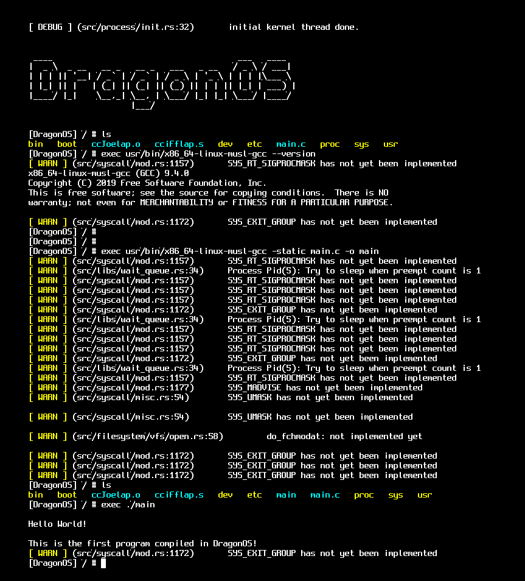

## 1\. 概要

### 1.1 摘要

目前在 [PR #440](https://github.com/DragonOS-Community/DragonOS/pull/440) 之后，DragonOS已经能够运行musl-gcc，并在DragonOS内编译hello world程序。

请注意，由于DragonOS尚未完善对动态链接的支持，因此静态链接版本的musl-gcc，能直接在Linux和DragonOS内运行，但不支持动态链接的。



版本信息：

```text
BINUTILS_VER = 2.33.1
GCC_VER = 9.4.0
MUSL_VER = 1.2.3
GMP_VER = 6.1.2
MPC_VER = 1.1.0
MPFR_VER = 4.0.2
LINUX_VER = headers-4.19.88-1

```

### 1.2 DragonOS介绍

DragonOS龙操作系统（以下简称“DragonOS”）是一个面向服务器领域的，从0开发内核及用户态环境，并提供Linux兼容性的64位操作系统。它使用Rust与C语言进行编写，并正在逐步淘汰原有的C代码，以在将来提供更好的安全性与可靠性.

代码仓库： [https://github.com/DragonOS-Community/DragonOS](https://github.com/DragonOS-Community/DragonOS)

## 2\. 安装上述版本的gcc

有两种方式安装：编译安装和下载已编译好的二进制。

**安装需求** 请注意，由于gcc工具链大小900MB，而默认创建的磁盘镜像大小不够，因此请修改`tools/create_hdd_image.sh`，把虚拟磁盘大小设置成1GB及以上。

### 2.1 二进制安装

### 2.1.1 下载

您可以通过以下2种方式下载：

- Github： [https://github.com/DragonOS-Community/musl-cross-make/releases/tag/9.4.0-231114](https://github.com/DragonOS-Community/musl-cross-make/releases/tag/9.4.0-231114)
- DragonOS镜像站：[https://mirrors.dragonos.org/pub/third\_party/toolchain/gcc/](https://mirrors.dragonos.org/pub/third_party/toolchain/gcc/)

### 2.1.2 安装

请将解压后的文件夹下的内容，复制到DragonOS目录的`bin/sysroot/usr`文件夹下，稍后make run的时候会自动把它拷贝进去。请注意，是把`x86_64-linux-musl-cross-gcc-9.4.0/*`复制进去，而不用把外层这个文件夹也复制进去。

## 2.2 编译安装

如果您想自己编译一遍，那么也是没有问题的，按照下面的步骤即可。

### 2.2.1 确认本机上不存在musl工具链

由于本文开头所述的：“DragonOS不支持动态链接”的原因，因此如果您本机存在musl工具链，官方编译版本的是工具链，会导致编出来的结果，包含动态链接的内容（或者是non-static-pie），从而无法在dragonos上运行。因此务必卸载/暂时取消环境变量，以确保编译过程中，能使用正确的工具链。

### 2.2.2 克隆仓库

您可以在以下地址克隆仓库：

- [https://github.com/DragonOS-Community/musl-cross-make.git](https://github.com/DragonOS-Community/musl-cross-make.git)
- [https://git.mirrors.dragonos.org/DragonOS-Community/musl-cross-make.git](https://git.mirrors.dragonos.org/DragonOS-Community/musl-cross-make.git)

### 2.2.3 编译

运行命令

```shell
bash dragonos.sh
```

经过一段时间的等待，该脚本会自动在您的计算机上安装静态链接版本的musl-gcc，并编译出最终的“能同时在DragonOS和Linux运行的musl-gcc. 输出在`output/`文件夹下。

### 2.2.4 安装

此处按照 **2.1.2 安装** 一节进行操作，把`output`文件夹下的结果，复制到对应位置即可。

## 3\. 联系方式

这项跟二进制兼容相关的工作持续了很久，主要工作由我和 @何懿聪 完成，可以通过以下方式找到我们：

- 龙进 longjin@dragonos.org
- 何懿聪 heyicong@dragonos.org

DragonOS社区zulip： [https://dragonos.zulipchat.com](https://dragonos.zulipchat.com)
